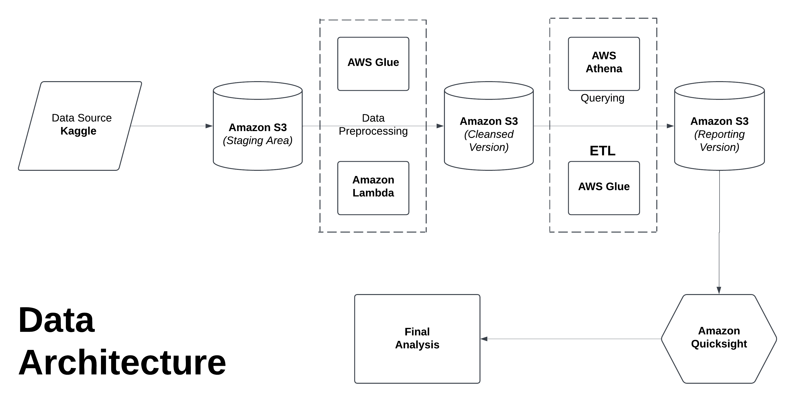

# End-to-End Data Pipeline for YouTube Data Analysis

## Overview

This project demonstrates an end-to-end data pipeline for analyzing YouTube data using AWS services. The pipeline extracts data from Kaggle, processes it using AWS Glue, and stores it in Amazon S3 for further analysis. The architecture leverages AWS Lambda for serverless computing, AWS Athena for querying, and Amazon Quicksight for data visualization. This project showcases a scalable and efficient solution for handling large datasets in the cloud.

## Data Source

The dataset used in this project is available on Kaggle. It can be accessed using the following link:

- [YouTube Dataset on Kaggle](https://www.kaggle.com/datasets/datasnaek/youtube-new)

---

## Project Architecture

The architecture of the project is designed to handle large-scale data processing efficiently. Below is a high-level overview of the components involved:

1. **Data Source**:
   - **Kaggle**: The raw YouTube data is sourced from Kaggle.

2. **Data Storage**:
   - **Amazon S3 (Staging Area)**: The raw data is initially stored in an S3 bucket for staging.

3. **Data Preprocessing**:
   - **AWS Glue**: The data undergoes preprocessing using AWS Glue, which includes cleaning and transforming the data.
   - **Amazon S3 (Cleansed Version)**: The cleansed data is stored back in S3 for further processing.

4. **Data Processing**:
   - **AWS Lambda**: Serverless functions are used for additional data processing tasks.
   - **AWS Glue (ETL)**: The data is further transformed and loaded into a reporting version in S3.

5. **Data Analysis**:
   - **AWS Athena**: Used for querying the processed data stored in S3.
   - **Amazon Quicksight**: Provides visualization capabilities to analyze and present the data insights.

---

### Prerequisites

- AWS Account with necessary permissions to use S3, AWS Glue, Lambda, Athena, and Quicksight.
- Basic understanding of AWS services and data engineering concepts.

### Steps to Reproduce

1. **Set Up S3 Buckets**:
   - Create S3 buckets to store raw, cleansed, and reporting data.

2. **Configure AWS Glue**:
   - Set up AWS Glue jobs to perform the data preprocessing and ETL processes.
   - Define the necessary transformations, such as cleaning and joining datasets.

3. **Set Up AWS Lambda**:
   - Configure AWS Lambda functions for additional data processing tasks.

4. **Run the Data Pipeline**:
   - Execute the AWS Glue jobs and Lambda functions to process the data.

5. **Analyze Data**:
   - Use AWS Athena to query the processed data.
   - Visualize the data using Amazon Quicksight.

---

## Conclusion

This project showcases a robust data pipeline for analyzing YouTube data using AWS services. By leveraging AWS Glue for data preprocessing, S3 for storage, Lambda for serverless computing, and Athena and Quicksight for analysis, the pipeline provides a scalable and efficient solution for handling large datasets.
